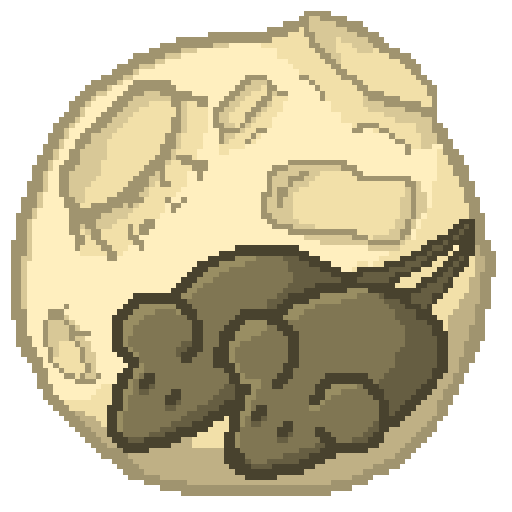

  <h1 align="center">Moon Mice - Having fun with C++</h1>
   
  

    
  

## About
I want to learn how C++ works. Here will be my implementations of some things.
Maybe they will not be so good, but I don't care. I want to try to use them in my future small projects.

Since I use Windows, the implementation details will be written in WinAPI.
And I chose Clang compiler for this project.

>[!NOTE]
>English is not my native language, so don't be angry. 🐈